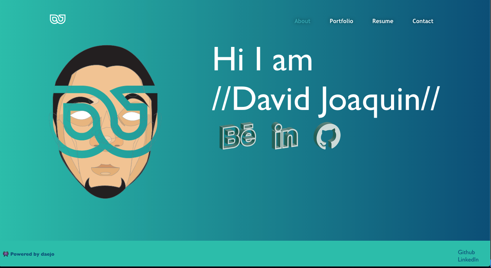

# react port
  
  
  

  ## Description 

  _View works I created and jump from link to link to connect with me professionally and leave me a message_
 
  ## Table of Contents

  * [Screenshot](#screenshot)
  * [Usage](#usage)
  * [Tools](#tools)

  

  ## Usage 

  _Click the link to jump to my web app [CLICK ME!](daejo.github.io/react-port)_ 

  ## Tools

  * HTML
  * CSS
  * JavaScript
  * Node.js
  * React

  ---
  ## Questions?
  _Contact me:_
  _[@daejo](github.com/daejo)_  
  _[https://github.com/daejo/react-port](https://github.com/daejo/react-port)_  
  
